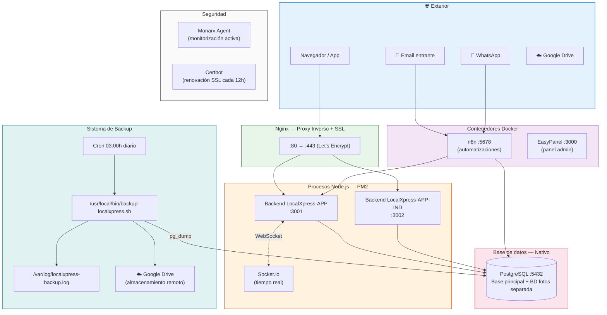
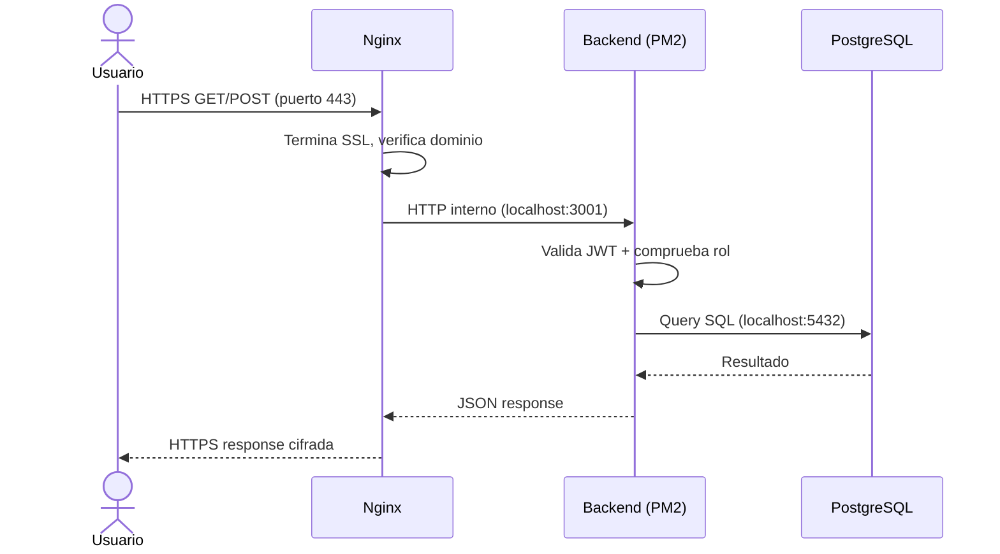
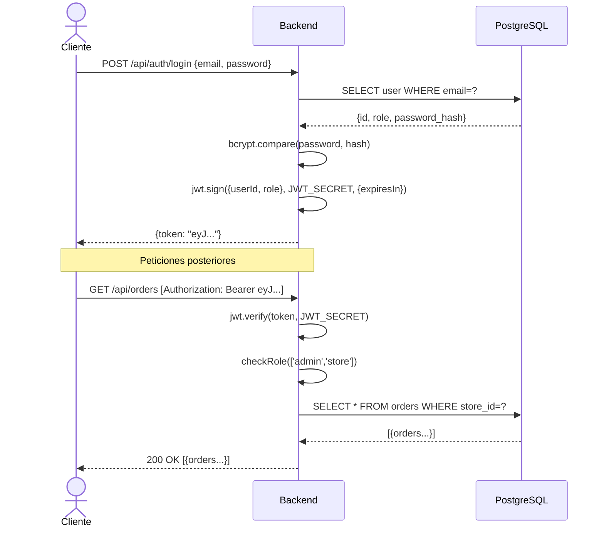
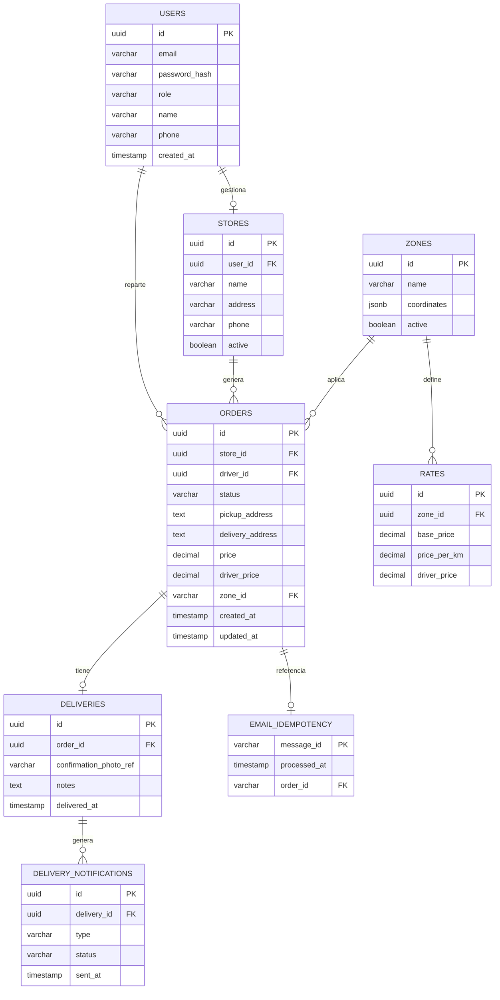
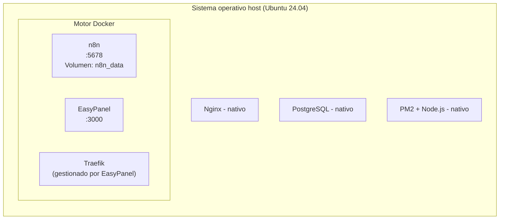
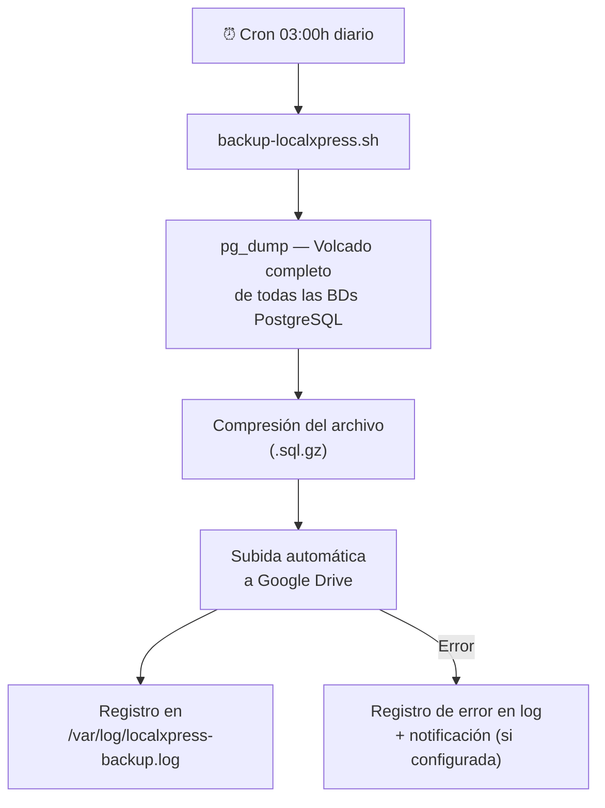
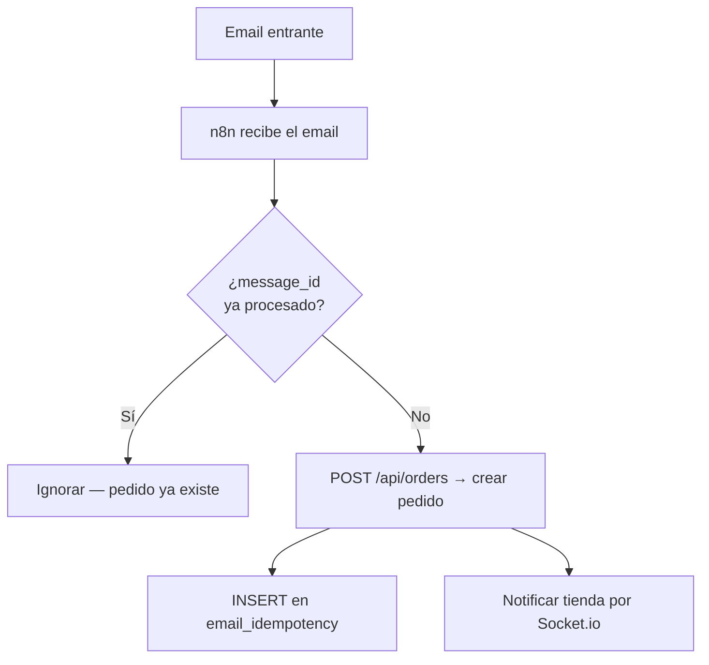
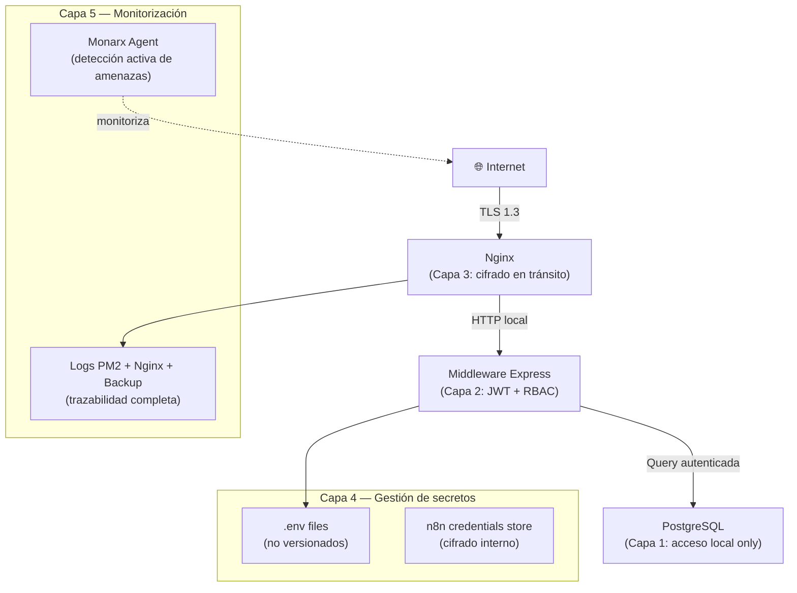
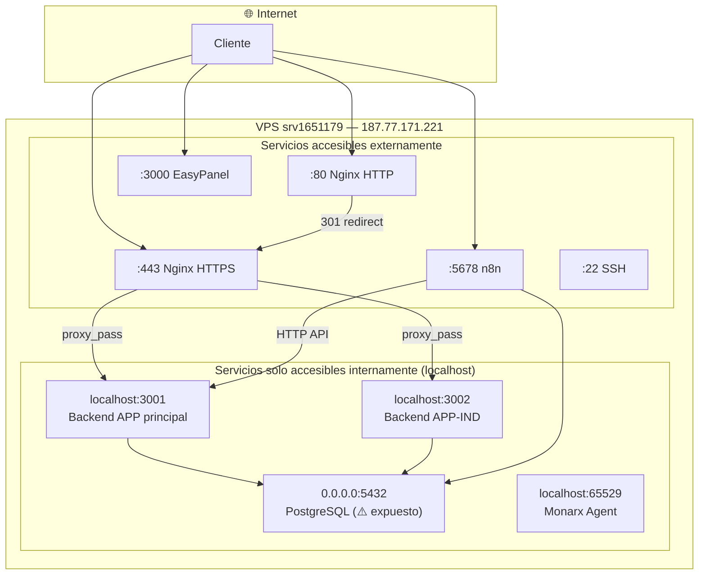

# Documentación Técnica del Proyecto LocalXpress

**Versión:** 2.0 — Basada en auditoría real del servidor  
**Fecha:** Mayo 2026  
**Servidor:** `srv1651179` — IP `187.77.171.221`  
**Clasificación:** Uso interno — Dirección / Responsables técnicos  

---

## Tabla de Contenidos

1. [Resumen ejecutivo](#1-resumen-ejecutivo)
2. [Objetivos del proyecto](#2-objetivos-del-proyecto)
3. [Alcance del proyecto](#3-alcance-del-proyecto)
4. [Arquitectura general del sistema](#4-arquitectura-general-del-sistema)
5. [Infraestructura del servidor VPS](#5-infraestructura-del-servidor-vps)
6. [Aplicaciones desplegadas](#6-aplicaciones-desplegadas)
7. [Backend — API y lógica de negocio](#7-backend--api-y-lógica-de-negocio)
8. [Base de datos PostgreSQL](#8-base-de-datos-postgresql)
9. [Proxy inverso y SSL — Nginx + Certbot](#9-proxy-inverso-y-ssl--nginx--certbot)
10. [Servicios en contenedores Docker](#10-servicios-en-contenedores-docker)
11. [Sistema de backup automático](#11-sistema-de-backup-automático)
12. [Automatizaciones con n8n](#12-automatizaciones-con-n8n)
13. [Seguridad del sistema](#13-seguridad-del-sistema)
14. [Red y comunicación entre servicios](#14-red-y-comunicación-entre-servicios)
15. [Gestión de procesos con PM2](#15-gestión-de-procesos-con-pm2)
16. [Fases del proyecto y evolución técnica](#16-fases-del-proyecto-y-evolución-técnica)
17. [Estado actual y próximos pasos](#17-estado-actual-y-próximos-pasos)
18. [Glosario técnico](#18-glosario-técnico)

---

## 1. Resumen ejecutivo

**LocalXpress** es una plataforma de reparto local de última milla desarrollada completamente desde cero, pensada para dar servicio a pequeñas y medianas empresas del sector local — floristerías, panaderías, empresas de catering y comercios similares — que necesitan gestionar pedidos y entregas de forma digital, centralizada y en tiempo real.

El proyecto ha sido construido íntegramente de forma interna, sin depender de plantillas ni soluciones cerradas de terceros para la lógica de negocio, la infraestructura ni la gestión de datos. Cada componente — desde el servidor hasta la base de datos, pasando por las APIs, los flujos de automatización y el sistema de backups — ha sido diseñado, configurado y desplegado a medida para las necesidades específicas de LocalXpress.

La plataforma da soporte a **tres perfiles de usuario diferenciados**:

| Perfil | Función principal |
|---|---|
| **Administrador** | Gestión global: usuarios, zonas, tarifas, métricas y configuración del sistema |
| **Comercio / Tienda** | Creación y seguimiento de pedidos, confirmaciones de entrega |
| **Repartidor** | Recepción de asignaciones, actualización de estado en ruta, confirmación de entregas |

Adicionalmente, existe una **segunda aplicación independiente** orientada a particulares (`LocalXpress-APP-IND`), con su propio repositorio, entorno y configuración.

Técnicamente, LocalXpress es una solución **full-stack autoalojada** al 100%: el frontend React/Vite, el backend Node.js gestionado con PM2, la base de datos PostgreSQL instalada de forma nativa en el servidor, el proxy inverso Nginx con SSL, el sistema de automatizaciones n8n y el sistema de backups automáticos con subida a Google Drive, todo convive en un único VPS de 96GB bajo Ubuntu 24.04 LTS.

**Estado actual (Mayo 2026):** El sistema está operativo en producción. El backend responde en los puertos 3001 y 3002, el proxy Nginx enruta el tráfico externo con SSL activo, los backups automáticos se ejecutan diariamente a las 3:00h, y n8n está activo y funcionando. El frontend está en fase final de integración con el nuevo backend propio.

---

## 2. Objetivos del proyecto

### 2.1 Objetivos estratégicos

- Digitalizar completamente la gestión de pedidos y entregas, eliminando dependencias de canales no estructurados como llamadas telefónicas, mensajes de WhatsApp o papel.
- Centralizar toda la información operativa en una base de datos propia, bajo control total del proyecto.
- Mejorar la trazabilidad de los repartos, permitiendo conocer en todo momento el estado de cada pedido, quién lo gestiona y cuándo fue entregado.
- Dar soporte tanto a comercios que contratan el servicio como a particulares que necesitan envíos puntuales, a través de dos aplicaciones diferenciadas.
- Construir una base técnica escalable que permita crecer en número de negocios, repartidores y zonas sin necesidad de rediseñar la arquitectura.

### 2.2 Objetivos técnicos

- Construir toda la infraestructura desde cero y autoalojarla en un VPS propio, eliminando dependencias y costes de plataformas externas.
- Separar correctamente las capas de presentación, lógica de negocio y datos, con servicios independientes y bien definidos.
- Implementar autenticación robusta mediante JWT con control de acceso por roles.
- Automatizar procesos operativos y de mantenimiento: captura de pedidos, notificaciones, y backups diarios con subida automática a Google Drive.
- Garantizar la continuidad del servicio mediante un sistema de recuperación ante fallos basado en backups periódicos y ramas de seguridad en Git antes de cada cambio crítico.
- Aplicar medidas de seguridad a todos los niveles: red, sistema operativo, aplicación, base de datos y automatizaciones.

---

## 3. Alcance del proyecto

### 3.1 Componentes actualmente en producción

| Componente | Tecnología | Estado |
|---|---|---|
| Aplicación principal LocalXpress | React + Vite + Node.js | ✅ Operativo |
| Aplicación para particulares (APP-IND) | React + Vite + Node.js | ✅ Operativo |
| Backend API REST | Node.js + Express (PM2) | ✅ Activo en :3001 y :3002 |
| Base de datos principal | PostgreSQL (nativo) | ✅ Activo en :5432 |
| Proxy inverso y SSL | Nginx + Certbot (Let's Encrypt) | ✅ Activo en :80 y :443 |
| Comunicación en tiempo real | Socket.io | ✅ Integrado en backend |
| Automatizaciones | n8n (Docker) | ✅ Activo en :5678 |
| Sistema de backup automático | Script bash + pg_dump + Google Drive | ✅ Cron diario a las 3:00h |
| Gestión de procesos | PM2 | ✅ Activo |
| Panel de administración de servidor | EasyPanel (Docker) | ✅ Activo en :3000 |
| Monitorización de seguridad | Monarx Agent | ✅ Activo |
| Renovación automática de certificados SSL | Certbot (cron) | ✅ Activo |

### 3.2 Pendiente o en desarrollo

| Componente | Estado |
|---|---|
| Integración de almacenamiento de imágenes de entrega (base de datos separada o MinIO) | 🔄 En integración |
| Reconexión completa del frontend al nuevo backend propio | 🔄 En progreso (login en integración final) |
| Configuración de flujos n8n (captura de pedidos por email/WhatsApp) | 🔄 En diseño |

### 3.3 Fuera del alcance actual

- Aplicación móvil nativa para repartidores.
- Integración con pasarelas de pago.
- Panel de analítica avanzada o Business Intelligence.
- Módulo de facturación automatizada.
- CDN para activos estáticos.

---

## 4. Arquitectura general del sistema

### 4.1 Visión de alto nivel

La arquitectura de LocalXpress sigue un modelo de **servidor único multi-servicio**, donde cada componente tiene una responsabilidad bien delimitada y se comunica con el resto a través de interfaces controladas. El tráfico externo entra siempre por Nginx, que actúa como puerta de entrada única (proxy inverso) y gestiona el SSL. Los servicios internos (PostgreSQL, n8n, EasyPanel) no son accesibles directamente desde internet.

```
Internet
    │
    ▼
┌──────────────────────────────────────────────────────────────┐
│  VPS Hostinger — srv1651179 — Ubuntu 24.04 LTS — 96GB        │
│                                                              │
│  ┌─────────────────────────────────────────────────────┐    │
│  │  Nginx (proxy inverso)  :80 / :443 (SSL Certbot)    │    │
│  └──────────────┬──────────────────────┬───────────────┘    │
│                 │                      │                     │
│       ┌─────────▼──────┐    ┌──────────▼──────┐            │
│       │  Backend APP   │    │  Backend APP-IND │            │
│       │  Node.js :3001 │    │  Node.js :3002   │            │
│       │  (PM2)         │    │  (PM2)           │            │
│       └────────┬───────┘    └─────────┬────────┘            │
│                │                      │                     │
│       ┌────────▼──────────────────────▼────────┐            │
│       │        PostgreSQL :5432 (nativo)        │            │
│       └─────────────────────────────────────────┘            │
│                                                              │
│  ┌─────────────┐  ┌──────────────┐  ┌──────────────────┐   │
│  │  n8n :5678  │  │ EasyPanel    │  │  Monarx Agent    │   │
│  │  (Docker)   │  │ :3000(Docker)│  │  (seguridad)     │   │
│  └─────────────┘  └──────────────┘  └──────────────────┘   │
│                                                              │
│  ┌──────────────────────────────────────────────────────┐   │
│  │  Cron Jobs:                                          │   │
│  │  - backup-localxpress (3:00h diario → Google Drive)  │   │
│  │  - certbot renew (cada 12h)                          │   │
│  │  - sysstat (cada 10 min)                             │   │
│  └──────────────────────────────────────────────────────┘   │
└──────────────────────────────────────────────────────────────┘
```

### 4.2 Diagrama de arquitectura completa



### 4.3 Flujo de una petición HTTP de extremo a extremo



---

## 5. Infraestructura del servidor VPS

### 5.1 Especificaciones del servidor

| Parámetro | Valor real |
|---|---|
| **Proveedor** | Hostinger VPS |
| **Hostname** | `srv1651179` |
| **IP pública** | `187.77.171.221` |
| **Sistema operativo** | Ubuntu 24.04.4 LTS (Noble Numbat) |
| **Kernel** | Linux 6.8.0-107-generic |
| **Arquitectura** | x86_64 |
| **Disco total** | 96 GB |
| **Disco usado** | 11 GB (11%) |
| **Disco disponible** | 86 GB (89%) |
| **RAM total** | 7.8 GB |
| **RAM en uso** | 1.6 GB |
| **RAM disponible** | 6.1 GB (incluyendo caché) |
| **Swap** | No configurada |
| **Acceso** | SSH root (:22) |

### 5.2 Uso de disco por partición

| Partición | Tamaño | Usado | Disponible | Punto de montaje |
|---|---|---|---|---|
| `/dev/sda1` | 96 GB | 11 GB | 86 GB | `/` (sistema principal) |
| `/dev/sda16` | 881 MB | 117 MB | 703 MB | `/boot` |
| `/dev/sda15` | 105 MB | 6.2 MB | 99 MB | `/boot/efi` |

El servidor tiene un margen de crecimiento muy amplio: actualmente solo usa el 11% del disco total, lo que garantiza estabilidad operativa a largo plazo sin necesidad de ampliar almacenamiento en el corto-medio plazo.

### 5.3 Software instalado en el sistema

| Software | Función | Modo de instalación |
|---|---|---|
| **Nginx** | Proxy inverso y servidor web | Nativo (systemd) |
| **PostgreSQL** | Base de datos relacional | Nativo (systemd) |
| **Node.js** | Entorno de ejecución del backend | Nativo |
| **PM2** | Gestor de procesos Node.js | npm global |
| **Docker + Docker Compose** | Orquestación de contenedores | Nativo |
| **Certbot** | Gestión de certificados SSL | Nativo (cron) |
| **Monarx Agent** | Seguridad y monitorización | Nativo (demonio) |
| **sysstat** | Estadísticas del sistema | Nativo (cron) |
| **Git** | Control de versiones | Nativo |

---

## 6. Aplicaciones desplegadas

El servidor aloja **dos aplicaciones independientes**, cada una con su propio directorio, repositorio Git, configuración de entorno y proceso backend en PM2.

### 6.1 LocalXpress-APP — Aplicación principal

| Parámetro | Valor |
|---|---|
| **Directorio** | `/home/LocalXpress-APP/` |
| **Repositorio** | GitHub (`skilax27`) |
| **Backend** | Node.js/Express — PM2 — puerto `:3001` |
| **Frontend** | React + Vite |
| **Base de datos** | PostgreSQL (instancia nativa compartida) |
| **Usuarios objetivo** | Administradores, comercios, repartidores |
| **Archivos de entorno** | `/home/LocalXpress-APP/.env` y `/home/LocalXpress-APP/backend/.env` |

**Estructura de directorios:**

```
/home/LocalXpress-APP/
├── backend/                  # Servidor Node.js/Express
│   ├── .env                  # Variables de entorno del backend
│   └── ...
├── database/
│   └── migrations/           # Migraciones SQL versionadas
│       ├── 001_...           # Esquema inicial
│       ├── 002_performance_indexes.sql
│       ├── 004_pricing_zone_driver_price.sql
│       ├── 007_delivery_notifications.sql
│       └── 008_email_idempotency.sql
├── supabase/
│   └── migrations/           # Historial de migraciones previas (Supabase legacy)
├── docker-compose.yml        # Orquestación de servicios
├── docker-compose.dev.yml    # Entorno de desarrollo
├── docker-compose.backup.yml # Configuración de backup
└── .env                      # Variables de entorno globales
```

### 6.2 LocalXpress-APP-IND — Aplicación para particulares

| Parámetro | Valor |
|---|---|
| **Directorio** | `/home/LocalXpress-APP-IND/` |
| **Backend** | Node.js — PM2 — puerto `:3002` |
| **Frontend** | React + Vite |
| **Usuarios objetivo** | Particulares que solicitan envíos |
| **Archivo de entorno** | `/home/LocalXpress-APP-IND/.env` |

Esta aplicación es completamente independiente de la principal: tiene su propio proceso de backend, su propia configuración y su propio repositorio Git. Comparte la infraestructura del servidor (PostgreSQL, Nginx, PM2) pero opera de forma autónoma.

**Skills de Claude Code configurados en APP-IND:**

```
/home/LocalXpress-APP-IND/.claude/
├── commands/
│   └── build-flow.md
└── skills/
    ├── localxpress-payments-security/
    ├── localxpress-public-orders/
    ├── production-readiness/
    └── security-hardening/
```

Esto indica que la aplicación de particulares tiene módulos de pago y seguridad específicos en desarrollo activo.

---

## 7. Backend — API y lógica de negocio

### 7.1 Stack tecnológico

| Tecnología | Función |
|---|---|
| **Node.js** | Entorno de ejecución del servidor |
| **Express** | Framework HTTP para la API REST |
| **Socket.io** | Comunicación bidireccional en tiempo real |
| **JWT (jsonwebtoken)** | Autenticación sin estado con tokens firmados |
| **bcryptjs** | Hash seguro de contraseñas |
| **pg (node-postgres)** | Cliente PostgreSQL para Node.js |
| **PM2** | Gestor de procesos en producción (reinicios automáticos, logs) |

### 7.2 Arquitectura del backend

El backend sigue el patrón **MVC ligero** con Express: las rutas delegan en controladores, los controladores interactúan con la base de datos a través de un módulo de conexión centralizado (pool de conexiones pg), y un conjunto de middlewares gestiona la autenticación, autorización y validación de entrada.

```
Petición HTTP entrante
        │
        ▼
┌───────────────┐
│  Middleware   │  → CORS, body-parser, rate limiting
│  global       │
└──────┬────────┘
       │
       ▼
┌───────────────┐
│  Router       │  → /api/auth, /api/orders, /api/users...
└──────┬────────┘
       │
       ▼
┌───────────────┐
│  Middleware   │  → verifyToken(jwt) → checkRole(admin|store|driver)
│  de auth      │
└──────┬────────┘
       │
       ▼
┌───────────────┐
│  Controlador  │  → lógica de negocio
└──────┬────────┘
       │
       ▼
┌───────────────┐
│  Pool pg      │  → consulta a PostgreSQL
└───────────────┘
```

### 7.3 Endpoints principales de la API

| Método | Endpoint | Rol requerido | Descripción |
|---|---|---|---|
| `POST` | `/api/auth/login` | Público | Devuelve JWT válido tras verificar credenciales |
| `POST` | `/api/auth/register` | Admin | Registro de nuevos usuarios en el sistema |
| `GET` | `/api/orders` | Admin / Tienda | Lista de pedidos con filtros |
| `POST` | `/api/orders` | Tienda | Crear nuevo pedido |
| `PATCH` | `/api/orders/:id/status` | Repartidor | Actualizar estado de un pedido en curso |
| `GET` | `/api/orders/:id` | Admin / Tienda / Repartidor | Detalle de un pedido concreto |
| `GET` | `/api/users` | Admin | Lista de usuarios del sistema |
| `GET` | `/api/zones` | Admin | Zonas de reparto configuradas |
| `GET` | `/api/rates` | Admin / Tienda | Tarifas aplicables por zona |
| `POST` | `/api/deliveries/:id/confirm` | Repartidor | Confirmación de entrega (foto) |
| `GET` | `/api/deliveries/notifications` | Admin / Tienda | Notificaciones de entrega (migración 007) |

### 7.4 Sistema de autenticación JWT



### 7.5 WebSocket — Actualizaciones en tiempo real

Socket.io corre en el mismo proceso Node.js que Express, compartiendo el mismo puerto (:3001). Los eventos en tiempo real permiten que los repartidores reciban nuevos pedidos al instante y que las tiendas vean actualizaciones de estado sin necesidad de recargar la página.

| Evento | Dirección | Descripción |
|---|---|---|
| `new_order` | Servidor → Repartidores | Nuevo pedido disponible para asignación |
| `order_updated` | Servidor → Tienda/Admin | Cambio de estado en un pedido activo |
| `order_confirmed` | Servidor → Tienda | Pedido entregado con confirmación fotográfica |
| `driver_location` | Repartidor → Servidor | Actualización de posición del repartidor (si aplica) |

### 7.6 Migraciones de base de datos versionadas

El proyecto mantiene un sistema de migraciones SQL versionadas en `/home/LocalXpress-APP/database/migrations/`, lo que garantiza que los cambios en el esquema de la base de datos están controlados, documentados y son reproducibles:

| Migración | Descripción |
|---|---|
| `001_...` | Esquema inicial — tablas base del sistema |
| `002_performance_indexes.sql` | Índices de rendimiento para consultas frecuentes |
| `004_pricing_zone_driver_price.sql` | Modelo de precios por zona y precio para el repartidor |
| `007_delivery_notifications.sql` | Sistema de notificaciones de entrega |
| `008_email_idempotency.sql` | Control de idempotencia para procesamiento de emails (evita duplicados en n8n) |

---

## 8. Base de datos PostgreSQL

### 8.1 Configuración y despliegue

PostgreSQL está instalado de forma **nativa en el sistema operativo** del VPS (no en Docker), lo que garantiza el máximo rendimiento de I/O y elimina la latencia de red de los contenedores. Está gestionado como servicio del sistema (`systemd`).

| Parámetro | Valor |
|---|---|
| **Motor** | PostgreSQL (versión nativa Ubuntu 24.04) |
| **Modo de despliegue** | Nativo en el SO (no Docker) |
| **Puerto** | 5432 |
| **Acceso externo** | Puerto expuesto en la interfaz de red del servidor |
| **Acceso desde backend** | `localhost:5432` (conexión local directa) |
| **Ubicación de datos** | `/var/lib/postgresql/` |

### 8.2 Estructura de bases de datos

El sistema utiliza **múltiples bases de datos separadas** dentro de la misma instancia PostgreSQL. Esta separación garantiza aislamiento entre la lógica principal de pedidos y el almacenamiento de datos relacionados con entregas (como confirmaciones fotográficas y metadatos asociados):

| Base de datos | Propósito |
|---|---|
| **Base de datos principal** | Usuarios, pedidos, zonas, tarifas, repartidores, comercios |
| **Base de datos de imágenes/entregas** | Almacenamiento de referencias y metadatos de confirmaciones de entrega (separada de la BD principal para mayor aislamiento y rendimiento) |

### 8.3 Modelo de datos principal



### 8.4 Índices de rendimiento aplicados

La migración `002_performance_indexes.sql` añade índices sobre los campos de consulta más frecuentes, optimizando el rendimiento de las consultas en operación:

- `orders.store_id` — filtrado de pedidos por comercio
- `orders.driver_id` — filtrado de pedidos por repartidor
- `orders.status` — filtrado por estado activo/completado
- `orders.created_at` — ordenación cronológica
- `deliveries.order_id` — acceso a confirmación de entrega por pedido

### 8.5 Idempotencia en procesamiento de emails

La migración `008_email_idempotency.sql` introduce una tabla de control de idempotencia para el procesamiento automático de emails desde n8n. Esto garantiza que si el mismo email llega más de una vez (reenvío, reintentos), no se cree un pedido duplicado en la base de datos.

---

## 9. Proxy inverso y SSL — Nginx + Certbot

### 9.1 Nginx como única puerta de entrada

**Nginx** actúa como proxy inverso para todo el tráfico externo del servidor. Toda petición que llega al servidor desde internet pasa obligatoriamente por Nginx, que:

- Termina la conexión SSL/TLS (descifra el tráfico HTTPS).
- Valida el dominio solicitado.
- Redirige la petición al proceso backend interno correspondiente (`localhost:3001` o `localhost:3002`) sin exponer esos puertos directamente a internet.
- Sirve los archivos estáticos del frontend compilado.

Los puertos `:80` y `:443` son los únicos expuestos a internet para tráfico de aplicación. El puerto `:80` redirige automáticamente a `:443`.

```
Internet → :443 (HTTPS) → Nginx → localhost:3001 (APP principal)
                                 → localhost:3002 (APP particulares)
Internet → :80  (HTTP)  → Nginx → Redirección 301 a HTTPS
```

### 9.2 Certificados SSL — Let's Encrypt + Certbot

Los certificados SSL son gestionados por **Certbot** con Let's Encrypt, y se renuevan automáticamente mediante un cron configurado en `/etc/cron.d/certbot`:

```
0 */12 * * *   certbot -q renew --no-random-sleep-on-renew
```

Esto intenta la renovación dos veces al día. Certbot solo renueva si el certificado está a menos de 30 días de expirar, por lo que el proceso es seguro y no genera carga innecesaria. El sistema garantiza que el servidor nunca opera con un certificado caducado.

---

## 10. Servicios en contenedores Docker

### 10.1 Arquitectura de contenedores

A diferencia del backend y PostgreSQL (que corren de forma nativa), los servicios auxiliares del sistema se despliegan en **contenedores Docker**, lo que simplifica su gestión, actualización y aislamiento.



### 10.2 Contenedores activos

| Contenedor | Imagen | Estado | Puertos | Persistencia |
|---|---|---|---|---|
| `n8n` | `n8nio/n8n:stable` | ✅ Up (5 días) | `0.0.0.0:5678` | Volumen `n8n_data` |
| `easypanel` | `easypanel/easypanel:latest` | ✅ Up (5 días) | `0.0.0.0:3000` | Interno EasyPanel |
| `easypanel-traefik` | `traefik:3.6.7` | Created (standby) | — | — |

**Nota sobre Traefik:** EasyPanel incluye Traefik como proxy interno para gestionar el enrutamiento de los servicios que despliega. Actualmente aparece en estado `Created` (preparado pero no activo), dado que el enrutamiento externo está gestionado directamente por Nginx.

### 10.3 Volúmenes Docker

| Volumen | Contenedor | Ruta real en el host | Contenido |
|---|---|---|---|
| `n8n_data` | n8n | `/var/lib/docker/volumes/n8n_data/_data` | Configuración, credenciales, flujos de trabajo y base de datos interna de n8n |

La persistencia de n8n es completa: todos los flujos de trabajo, credenciales de servicios externos y configuración de n8n se almacenan en el volumen `n8n_data`, que sobrevive a reinicios y actualizaciones del contenedor.

### 10.4 Docker Compose — Archivos de configuración

El proyecto mantiene tres archivos Docker Compose para distintos escenarios:

| Archivo | Propósito |
|---|---|
| `docker-compose.yml` | Configuración de producción |
| `docker-compose.dev.yml` | Configuración de desarrollo local |
| `docker-compose.backup.yml` | Configuración específica para operaciones de backup |

---

## 11. Sistema de backup automático

### 11.1 Descripción general

LocalXpress cuenta con un sistema de backup automático completamente funcional y operativo, que ejecuta cada noche a las 3:00h una copia de seguridad completa de la base de datos y la sube automáticamente a **Google Drive**.

Este sistema fue construido desde cero como parte de la infraestructura propia del proyecto, garantizando la recuperabilidad ante cualquier fallo del servidor.

### 11.2 Componentes del sistema de backup

| Componente | Detalle |
|---|---|
| **Script principal** | `/usr/local/bin/backup-localxpress.sh` |
| **Log de ejecución** | `/var/log/localxpress-backup.log` |
| **Cron job** | `/etc/cron.d/localxpress-backup` |
| **Frecuencia** | Diaria a las 3:00h (hora del servidor) |
| **Destino remoto** | Google Drive |
| **Herramienta de volcado** | `pg_dump` (PostgreSQL nativo) |

### 11.3 Cron job de backup

```bash
# /etc/cron.d/localxpress-backup
0 3 * * *   root   /usr/local/bin/backup-localxpress.sh >> /var/log/localxpress-backup.log 2>&1
```

El script se ejecuta como `root`, registra toda su salida (éxitos y errores) en el archivo de log, y redirige también el stderr para capturar cualquier fallo.

### 11.4 Flujo del proceso de backup



### 11.5 Ramas de Git como backup de código antes de cambios críticos

Además del backup de base de datos, el equipo de desarrollo mantiene una práctica de **crear ramas Git de salvaguarda** antes de cada cambio crítico en el código del servidor. Estas ramas están documentadas en el repositorio con nombres descriptivos que incluyen fecha y contexto:

```
backup-vps-before-scheduled-time-20260511-143451
backup-vps-before-final-pickup-fix-20260511-160817
```

Esta práctica garantiza que cualquier cambio en producción puede revertirse al estado previo exacto en cuestión de segundos.

---

## 12. Automatizaciones con n8n

### 12.1 n8n en producción

n8n está desplegado en Docker con el contenedor `n8nio/n8n:stable`, lleva 5 días en ejecución continua y tiene su estado completamente persistido en el volumen `n8n_data`. Es accesible en el puerto `:5678` del servidor.

n8n actúa como el **motor de automatización e integración** de LocalXpress, conectando los canales de entrada de pedidos (email, WhatsApp) con el backend de la plataforma, y gestionando las notificaciones salientes.

### 12.2 Flujos planificados y en configuración

| Flujo | Disparador | Acciones | Estado |
|---|---|---|---|
| **Captura de pedidos por email** | Email entrante | Parsear → validar idempotencia → POST /api/orders | 🔄 En configuración |
| **Captura de pedidos por WhatsApp** | Mensaje WhatsApp Business API | Interpretar → crear pedido vía API | 🔄 En diseño |
| **Notificaciones de entrega** | Webhook del backend (evento entrega) | Enviar email o WhatsApp al cliente final | 🔄 En diseño |
| **Reporte diario operativo** | Cron n8n (20:00h) | Consultar DB → generar resumen → enviar por email | 🔄 En diseño |

### 12.3 Idempotencia en procesamiento de emails

Para evitar la creación de pedidos duplicados cuando n8n procesa emails que llegan más de una vez, el sistema implementa una tabla de idempotencia en PostgreSQL (`008_email_idempotency.sql`). Antes de crear un pedido desde un email, n8n consulta esta tabla para verificar si el `message_id` del email ya fue procesado. Si ya existe, omite la creación.



---

## 13. Seguridad del sistema

### 13.1 Niveles de seguridad implementados

La seguridad de LocalXpress se aplica en **cinco capas diferenciadas**, desde la red hasta la aplicación:

#### Capa 1 — Red y exposición de servicios

| Puerto | Servicio | Acceso externo |
|---|---|---|
| 22 | SSH | ✅ Sí (acceso administrativo) |
| 80 | Nginx HTTP | ✅ Sí (redirige a HTTPS) |
| 443 | Nginx HTTPS | ✅ Sí (tráfico de aplicación) |
| 3001 | Backend APP | ❌ No (solo localhost) |
| 3002 | Backend APP-IND | ❌ No (solo localhost) |
| 5432 | PostgreSQL | ⚠️ Expuesto (recomendable restringir a localhost) |
| 5678 | n8n | ✅ Sí (gestión de automatizaciones) |
| 3000 | EasyPanel | ✅ Sí (panel de administración del servidor) |
| 65529 | Monarx Agent | ❌ No (solo localhost — agente interno) |

#### Capa 2 — Autenticación y autorización

- Todos los endpoints del backend están protegidos por JWT con verificación de firma criptográfica.
- El control de acceso basado en roles (RBAC) se aplica en cada endpoint: un repartidor no puede acceder a endpoints de administración, y una tienda no puede modificar pedidos de otras tiendas.
- Las contraseñas se almacenan exclusivamente como hashes bcrypt (10 rondas de sal), nunca en texto plano.

#### Capa 3 — Transporte cifrado

- Todo el tráfico externo viaja sobre HTTPS (TLS) gracias a los certificados Let's Encrypt gestionados por Certbot.
- Los certificados se renuevan automáticamente cada 12 horas (solo actúa si quedan menos de 30 días), garantizando que nunca expiran de forma inadvertida.

#### Capa 4 — Variables sensibles y secretos

- Las credenciales de base de datos, claves JWT, claves de servicios externos y configuraciones sensibles se gestionan exclusivamente a través de archivos `.env` ubicados en los directorios de la aplicación.
- Los archivos `.env` no están versionados en Git (se excluyen mediante `.gitignore`).
- Las credenciales de servicios externos (SMTP, WhatsApp API, Google Drive) se almacenan cifradas en el almacén interno de n8n.

#### Capa 5 — Monitorización de seguridad activa

**Monarx** es un agente de seguridad activo instalado de forma nativa en el servidor. Está en ejecución continua (proceso `monarx-agent`) y se actualiza automáticamente cada sábado a las 12:14h mediante un cron job dedicado:

```bash
# /etc/cron.d/monarx-update
14 12 * * 6   root   apt-get update -qq && apt-get install -y -qq monarx-agent monarx-protect monarx-protect-autodetect
```

Monarx proporciona detección de malware, análisis de comportamiento anómalo y alertas en tiempo real sobre el servidor.

### 13.2 Diagrama de seguridad por capas



### 13.3 Recomendaciones pendientes

| Mejora | Prioridad | Descripción |
|---|---|---|
| Restringir PostgreSQL a localhost | Alta | El puerto 5432 está actualmente expuesto a internet. Debería restringirse a `127.0.0.1:5432` en `postgresql.conf` y `pg_hba.conf` |
| Firewall UFW | Alta | Configurar UFW para permitir solo los puertos necesarios (22, 80, 443, 5678, 3000) |
| Fail2ban | Media | Protección contra fuerza bruta en SSH y endpoints de login |
| Alertas de backup | Media | Notificación por email si el backup nocturno falla |

---

## 14. Red y comunicación entre servicios

### 14.1 Mapa de puertos y comunicación interna



### 14.2 Comunicación entre servicios

| Origen | Destino | Protocolo | Puerto |
|---|---|---|---|
| Nginx | Backend APP | HTTP (local) | 3001 |
| Nginx | Backend APP-IND | HTTP (local) | 3002 |
| Backend APP | PostgreSQL | TCP (pg protocol) | 5432 |
| Backend APP-IND | PostgreSQL | TCP (pg protocol) | 5432 |
| n8n | Backend APP | HTTP REST | 3001 |
| n8n | PostgreSQL | TCP (pg protocol) | 5432 |
| Cliente web | Backend APP | WebSocket (Socket.io) | 3001 (vía Nginx) |
| Script backup | PostgreSQL | pg_dump (local) | 5432 |
| Script backup | Google Drive | HTTPS | 443 |

---

## 15. Gestión de procesos con PM2

### 15.1 PM2 como gestor de procesos en producción

**PM2** gestiona los procesos Node.js del backend de ambas aplicaciones en el servidor. PM2 garantiza:

- **Alta disponibilidad:** Reinicio automático del proceso si cae por cualquier motivo.
- **Inicio automático al arranque:** Los procesos se levantan solos si el servidor se reinicia.
- **Gestión de logs:** PM2 centraliza los logs de salida y error de cada proceso.
- **Rotación de logs:** pm2-logrotate está instalado para evitar que los archivos de log crezcan indefinidamente.
- **Monitorización de procesos:** PM2 expone métricas de CPU y memoria por proceso.

### 15.2 Procesos gestionados

| Proceso | Puerto | Directorio | Descripción |
|---|---|---|---|
| Backend LocalXpress-APP | 3001 | `/home/LocalXpress-APP/backend/` | API principal (admin, tienda, repartidor) |
| Backend LocalXpress-APP-IND | 3002 | `/home/LocalXpress-APP-IND/` | API aplicación de particulares |

### 15.3 Módulos PM2 instalados

| Módulo | Función |
|---|---|
| `pm2-logrotate` | Rotación automática de logs de PM2 |

---

## 16. Fases del proyecto y evolución técnica

El proyecto LocalXpress fue construido **completamente desde cero**, sin partir de plantillas, boilerplates ni código preexistente. Cada decisión técnica, desde la elección del stack hasta la configuración de cada servicio, fue tomada e implementada a medida.

### Fase 0 — Diseño y arquitectura inicial ✅

Definición de los requisitos del sistema, diseño de la arquitectura técnica, elección del stack tecnológico y planificación de las fases de desarrollo. Diseño del modelo de datos inicial y decisiones sobre la infraestructura de despliegue.

---

### Fase 1 — Infraestructura base ✅

Aprovisionamiento del VPS Hostinger con Ubuntu 24.04. Instalación y configuración de: Node.js, PostgreSQL nativo, Nginx, Docker, PM2, Certbot. Configuración inicial del proxy inverso, certificados SSL y estructura de directorios del servidor.

**Hito clave:** Servidor base completamente operativo con SSL activo.

---

### Fase 2 — Base de datos y esquema ✅

Diseño e implementación del esquema PostgreSQL completo. Creación del sistema de migraciones versionadas. Implementación del modelo de múltiples bases de datos (BD principal + BD de imágenes separada). Datos semilla para desarrollo y pruebas.

**Hito clave:** Base de datos con esquema completo, migraciones numeradas y datos de prueba cargados.

---

### Fase 3 — Backend y API ✅

Desarrollo completo del servidor Node.js/Express: endpoints REST, sistema de autenticación JWT, control de acceso por roles (RBAC), conexión con PostgreSQL mediante pool de conexiones, integración de Socket.io para tiempo real, configuración de PM2 para producción.

**Hito clave:** API REST completamente funcional, autenticación operativa, WebSocket activo.

---

### Fase 4 — Sistema de backup automático ✅

Desarrollo del script `/usr/local/bin/backup-localxpress.sh`, configuración del cron job en `/etc/cron.d/localxpress-backup`, integración con Google Drive para almacenamiento remoto de los dumps de PostgreSQL. Sistema de logging con registro de cada ejecución.

**Hito clave:** Backup automático diario funcionando con subida a Google Drive y log de ejecución.

---

### Fase 5 — Frontend y reconexión al backend propio 🔄

Desarrollo de las interfaces React/Vite para los tres roles de usuario (admin, tienda, repartidor) y para la aplicación de particulares. Sustitución del cliente Supabase por Axios con JWT. Reconexión de Socket.io en el cliente. Correcciones de CSP en el build de Vite.

**Estado actual:** Login en integración final. Módulos de gestión de pedidos en fase de reconexión.

---

### Fase 6 — Automatizaciones n8n 🔜

Configuración de los flujos de trabajo en n8n: captura de pedidos por email y WhatsApp, notificaciones automáticas, reportes diarios. Pruebas de idempotencia con la tabla `email_idempotency`.

---

### Fase 7 — Almacenamiento de imágenes de entrega 🔜

Integración completa del sistema de almacenamiento de imágenes de confirmación de entrega con la base de datos secundaria. Subida de fotos desde el frontend del repartidor, almacenamiento de referencias en la BD de imágenes.

---

### Fase 8 — Hardening y optimización final 🔜

Restricción del puerto PostgreSQL a `localhost`. Configuración de firewall UFW. Alertas de backup por email. Optimización de la configuración de Nginx. Documentación de operaciones y runbooks de recuperación ante desastres.

---

## 17. Estado actual y próximos pasos

### 17.1 Estado operativo del sistema (Mayo 2026)

```
INFRAESTRUCTURA
✅ VPS Hostinger Ubuntu 24.04 — 96GB disco, 7.8GB RAM
✅ Nginx proxy inverso — :80 y :443 activos
✅ SSL Let's Encrypt — Certbot con renovación automática
✅ PostgreSQL nativo — :5432 activo
✅ Docker con n8n — :5678 activo (up 5 días)
✅ EasyPanel — :3000 activo (up 5 días)
✅ PM2 — procesos Node.js activos en :3001 y :3002
✅ Monarx Agent — monitorización de seguridad activa
✅ Backup automático diario — 3:00h → Google Drive
✅ Rotación de logs — pm2-logrotate activo

APLICACIÓN
✅ Backend APP principal — Node.js :3001 operativo
✅ Backend APP-IND (particulares) — Node.js :3002 operativo
✅ Base de datos principal — esquema completo + migraciones aplicadas
✅ Base de datos imágenes — separada e independiente
✅ Sistema de autenticación JWT — funcional
✅ WebSocket Socket.io — activo
🔄 Frontend → Backend: login en integración final
🔄 Módulos de pedidos en frontend — reconexión en progreso
🔜 Flujos n8n — en configuración
🔜 Integración completa almacenamiento imágenes
🔜 Hardening de seguridad (restricción :5432, UFW)
```

### 17.2 Próximas acciones prioritarias

| Prioridad | Acción | Descripción |
|---|---|---|
| 🔴 Alta | Completar integración login frontend | Depurar Network Tab para identificar el fallo exacto en el intercambio JWT |
| 🔴 Alta | Reconectar módulos de pedidos en frontend | Sustituir llamadas Supabase restantes por Axios |
| 🔴 Alta | Restringir PostgreSQL a localhost | Editar `postgresql.conf` y `pg_hba.conf` para cerrar :5432 al exterior |
| 🟡 Media | Configurar firewall UFW | Permitir solo puertos 22, 80, 443, 3000, 5678 |
| 🟡 Media | Configurar flujos n8n | Empezar por captura de pedidos por email (idempotencia ya preparada) |
| 🟡 Media | Integrar almacenamiento imágenes entrega | Endpoint de subida de foto → BD imágenes |
| 🟢 Baja | Alertas de backup por email | Notificación si el cron de backup falla |
| 🟢 Baja | Fail2ban | Protección SSH y endpoint login contra fuerza bruta |

---

## 18. Glosario técnico

| Término | Definición |
|---|---|
| **VPS** | Virtual Private Server. Servidor virtual con recursos dedicados alojado en la infraestructura de un proveedor cloud |
| **PM2** | Process Manager 2. Gestor de procesos Node.js para producción con reinicio automático, logs y monitorización |
| **Nginx** | Servidor web y proxy inverso de alto rendimiento, usado aquí como puerta de entrada única al sistema |
| **Proxy inverso** | Servidor que recibe peticiones externas y las redirige internamente al servicio correspondiente, ocultando la infraestructura interna |
| **SSL/TLS** | Protocolo de cifrado que protege las comunicaciones entre el cliente y el servidor (HTTPS) |
| **Certbot** | Herramienta oficial para gestionar certificados SSL gratuitos de Let's Encrypt |
| **JWT** | JSON Web Token. Estándar para transmitir información de autenticación firmada digitalmente entre cliente y servidor |
| **RBAC** | Role-Based Access Control. Control de acceso donde los permisos dependen del rol del usuario |
| **bcrypt** | Algoritmo de hash para contraseñas que incluye sal y es resistente a ataques por fuerza bruta |
| **Docker** | Plataforma de contenedores que empaqueta aplicaciones y sus dependencias en unidades aisladas |
| **Docker Compose** | Herramienta para definir y gestionar aplicaciones multicontenedor mediante un archivo YAML |
| **PostgreSQL** | Sistema de gestión de bases de datos relacional de código abierto, de alto rendimiento y fiabilidad |
| **pg_dump** | Utilidad de PostgreSQL para crear volcados (dumps) completos de la base de datos |
| **Socket.io** | Librería que habilita comunicación bidireccional en tiempo real entre cliente y servidor mediante WebSockets |
| **n8n** | Plataforma open source de automatización de flujos de trabajo, autoalojable y extensible |
| **EasyPanel** | Panel de administración web para gestionar aplicaciones y contenedores en un VPS |
| **Monarx** | Agente de seguridad para servidores Linux que detecta malware y comportamiento anómalo en tiempo real |
| **Idempotencia** | Propiedad de una operación que produce el mismo resultado aunque se ejecute múltiples veces |
| **Migración SQL** | Script SQL versionado que aplica cambios controlados y reproducibles al esquema de la base de datos |
| **Traefik** | Proxy inverso y balanceador de carga moderno, integrado en EasyPanel para enrutamiento interno |
| **Webhook** | Mecanismo por el que una aplicación envía notificaciones HTTP automáticas a otra cuando ocurre un evento |
| **CORS** | Cross-Origin Resource Sharing. Política del navegador que controla qué dominios pueden hacer peticiones a un servidor |
| **CSP** | Content Security Policy. Cabecera HTTP que controla qué recursos puede cargar el navegador, mitigando ataques XSS |

---

*Documento generado en **Mayo de 2026** — LocalXpress — Confidencial, uso interno*  
*Basado en auditoría real del servidor `srv1651179` (187.77.171.221)*  
*Para actualizaciones, contactar con el equipo técnico de LocalXpress.*
