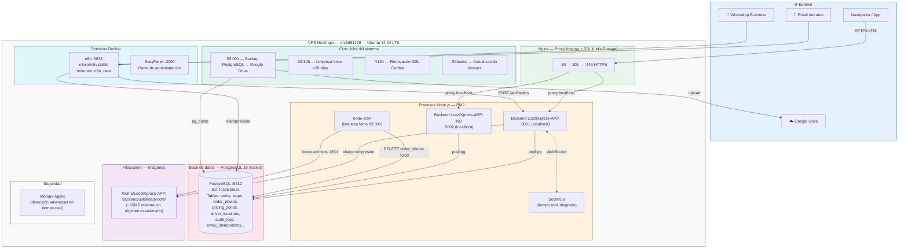

# Diagrama — Arquitectura General

```mermaid
flowchart TD
    subgraph EXT["🌐 Exterior"]
        Browser[Navegador / App]
        Email[📧 Email entrante]
        WA[💬 WhatsApp Business]
        GDrive[☁️ Google Drive]
    end

    subgraph VPS["VPS Hostinger — srv1651179 — Ubuntu 24.04 LTS"]

        subgraph NGINX["Nginx — Proxy Inverso + SSL (Let's Encrypt)"]
            NX[":80 → 301 → :443 HTTPS"]
        end

        subgraph PM2["Procesos Node.js — PM2"]
            BE1["Backend LocalXpress-APP\n:3001 (localhost)"]
            BE2["Backend LocalXpress-APP-IND\n:3002 (localhost)"]
            WS["Socket.io\n(tiempo real integrado)"]
            SCHEDULER["node-cron\n(limpieza fotos 02:30h)"]
        end

        subgraph DB["Base de datos — PostgreSQL 16 (nativo)"]
            PG[("PostgreSQL :5432\nBD: localxpress\nTablas: users, stops, order_photos,\npricing_zones, driver_locations,\naudit_logs, email_idempotency...")]
        end

        subgraph FS["Filesystem — Imágenes"]
            UPLOADS["/home/LocalXpress-APP/\nbackend/uploads/proofs/\n(~60MB máximo en régimen estacionario)"]
        end

        subgraph DOCKER["Servicios Docker"]
            N8N["n8n :5678\nn8nio/n8n:stable\nVolumen: n8n_data"]
            EP["EasyPanel :3000\nPanel de administración"]
        end

        subgraph CRON["Cron Jobs del sistema"]
            C1["03:00h — Backup PostgreSQL → Google Drive"]
            C2["02:30h — Limpieza fotos >20 días"]
            C3["*/12h — Renovación SSL Certbot"]
            C4["Sábados — Actualización Monarx"]
        end

        subgraph SEC["Seguridad"]
            MONARX["Monarx Agent\n(detección amenazas en tiempo real)"]
        end
    end

    Browser -->|HTTPS :443| NX
    NX -->|proxy localhost| BE1
    NX -->|proxy localhost| BE2
    BE1 <-.->|WebSocket| WS
    BE1 -->|pool pg| PG
    BE2 -->|pool pg| PG
    BE1 -->|sharp compresión| UPLOADS
    SCHEDULER -->|borra archivos >20d| UPLOADS
    SCHEDULER -->|DELETE order_photos >20d| PG

    Email --> N8N
    WA --> N8N
    N8N -->|POST /api/orders| BE1
    N8N -->|idempotencia| PG

    C1 -->|pg_dump| PG
    C1 -->|upload| GDrive

    style EXT fill:#e3f2fd,stroke:#1565c0
    style VPS fill:#f9f9f9,stroke:#666
    style NGINX fill:#e8f5e9,stroke:#2e7d32
    style PM2 fill:#fff3e0,stroke:#e65100
    style DB fill:#fce4ec,stroke:#c62828
    style FS fill:#f3e5f5,stroke:#6a1b9a
    style DOCKER fill:#e0f7fa,stroke:#00838f
    style CRON fill:#e0f2f1,stroke:#00695c
    style SEC fill:#fafafa,stroke:#424242
```
