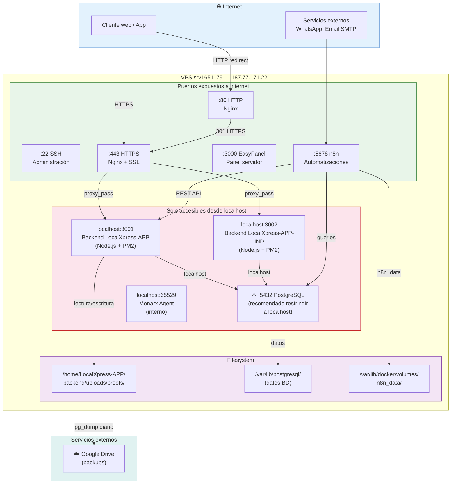

# Diagrama — Arquitectura de Red

## Tabla de puertos

| Puerto | Servicio | Exposición | Notas |
|---|---|---|---|
| 22 | SSH | 🌐 Público | Acceso administrativo al servidor |
| 80 | Nginx HTTP | 🌐 Público | Redirige siempre a HTTPS |
| 443 | Nginx HTTPS | 🌐 Público | Entrada principal de la aplicación |
| 3000 | EasyPanel | 🌐 Público | Panel de gestión del servidor |
| 5678 | n8n | 🌐 Público | Interfaz de automatizaciones |
| 3001 | Backend APP | 🔒 Localhost | Solo accesible desde Nginx o el propio servidor |
| 3002 | Backend APP-IND | 🔒 Localhost | Solo accesible desde Nginx o el propio servidor |
| 5432 | PostgreSQL | ⚠️ Expuesto | Pendiente restringir a localhost |
| 65529 | Monarx Agent | 🔒 Localhost | Agente de seguridad interno |
