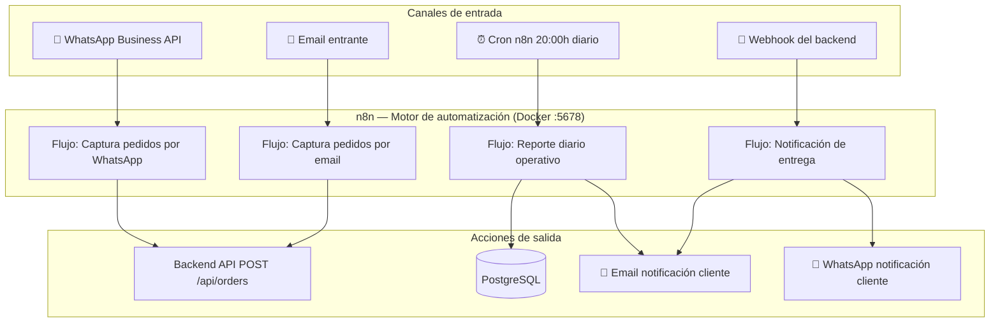
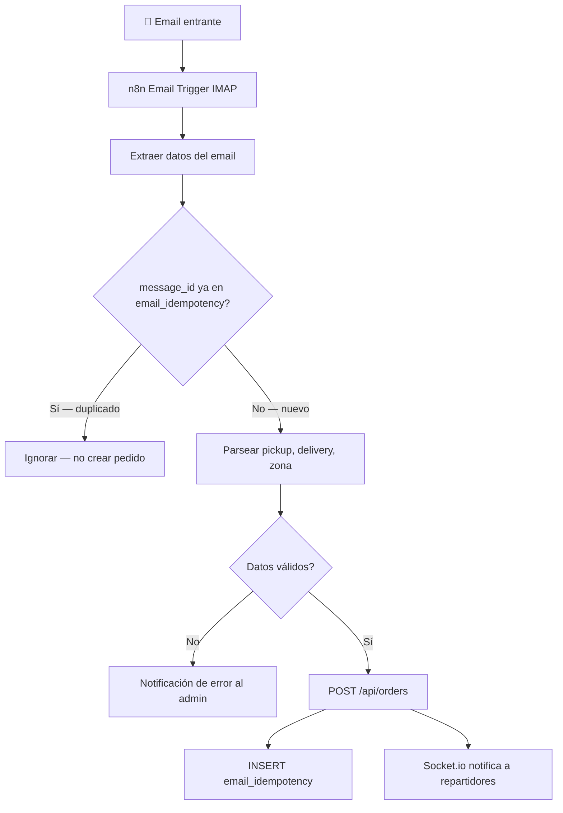
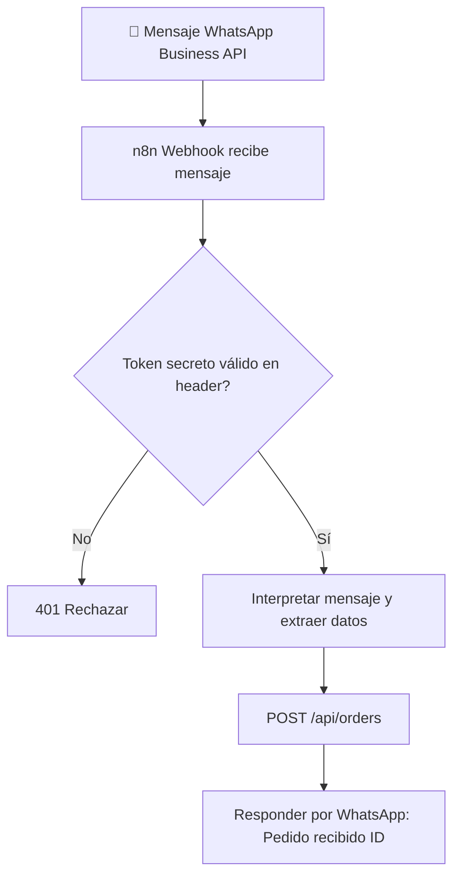
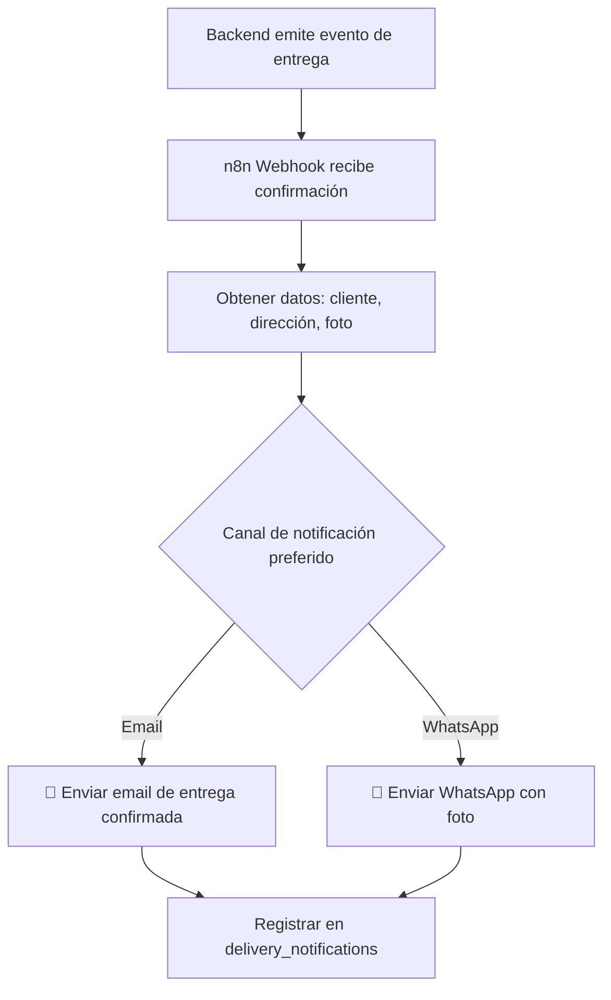
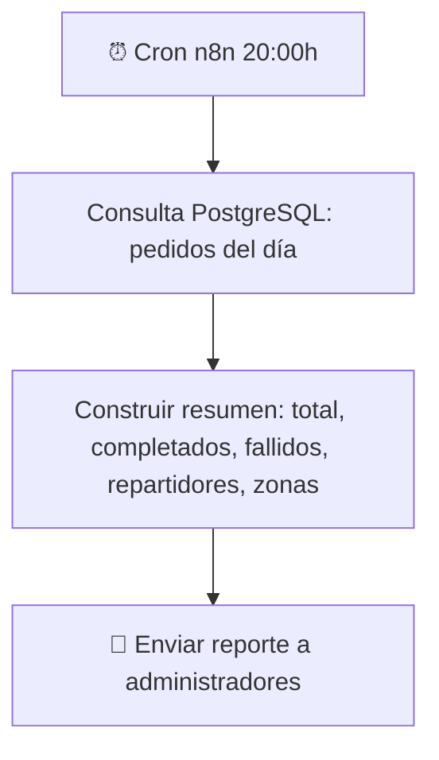

# Diagrama — Automatizaciones n8n

## Arquitectura general de n8n en LocalXpress



## Flujo 1 — Captura de pedidos por email



## Flujo 2 — Captura de pedidos por WhatsApp



## Flujo 3 — Notificación de entrega al cliente



## Flujo 4 — Reporte diario operativo



## Configuración de n8n en el servidor

| Parámetro | Valor |
|---|---|
| Imagen Docker | `n8nio/n8n:stable` |
| Puerto | `5678` |
| Volumen de datos | `/var/lib/docker/volumes/n8n_data/_data/` |
| Credenciales externas | Almacenadas cifradas en n8n credentials store |

## Seguridad en los webhooks

Todos los webhooks que reciben datos externos validan un token secreto en el header de la petición:

```
Header requerido: X-LocalXpress-Token: <token_secreto>
```

Si el token no está presente o no coincide, el webhook devuelve `401 Unauthorized`.
