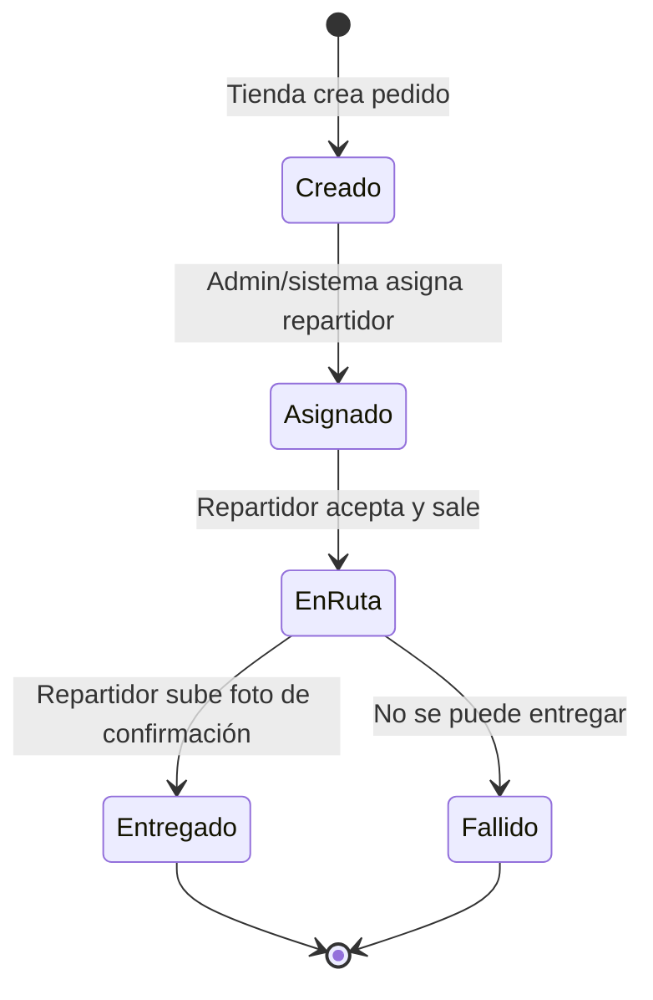
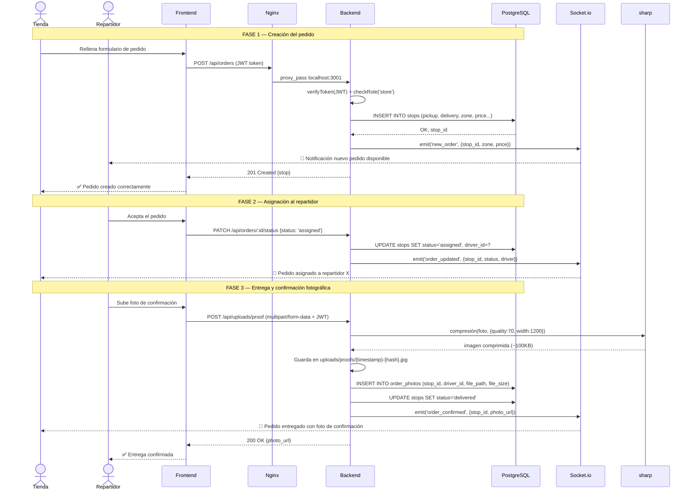
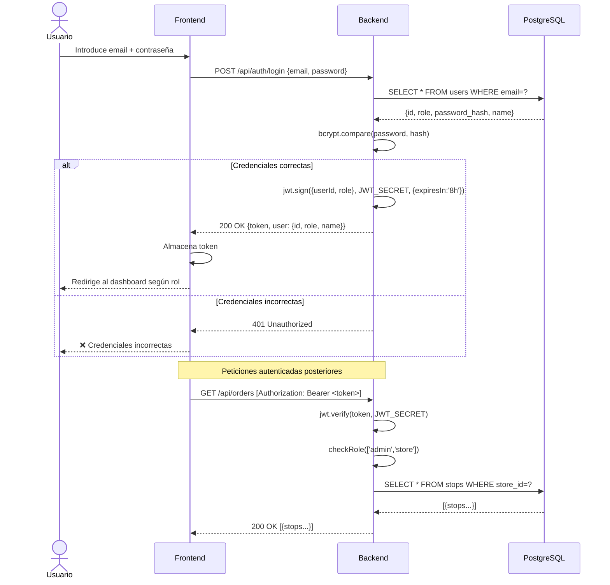
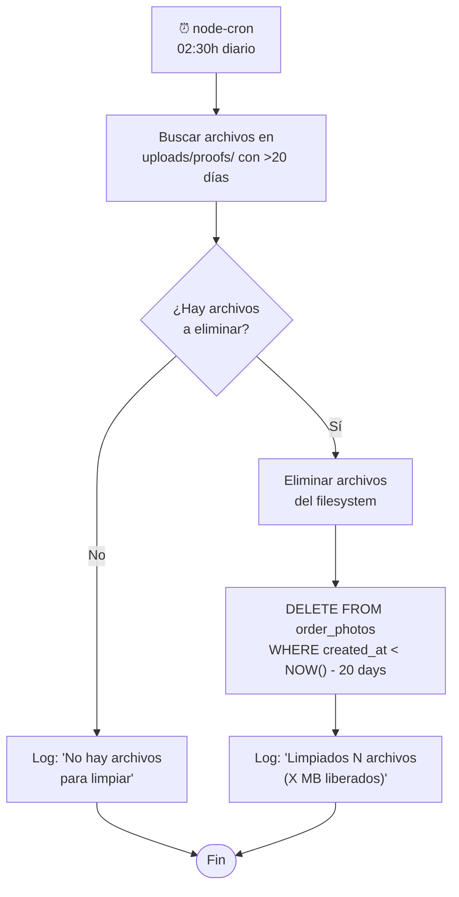

# Diagrama — Flujo de un Pedido

## Ciclo de vida completo

```mermaid
stateDiagram-v2
    [*] --> Creado: Tienda crea pedido
    Creado --> Asignado: Admin/sistema asigna repartidor
    Asignado --> EnRuta: Repartidor acepta y sale
    EnRuta --> Entregado: Repartidor sube foto de confirmación
    EnRuta --> Fallido: No se puede entregar
    Entregado --> [*]
    Fallido --> [*]
```

## Secuencia detallada — Creación y entrega

```mermaid
sequenceDiagram
    actor Tienda
    actor Repartidor
    participant Frontend
    participant Nginx
    participant Backend
    participant PostgreSQL
    participant Socket.io
    participant sharp

    Note over Tienda,PostgreSQL: FASE 1 — Creación del pedido

    Tienda->>Frontend: Rellena formulario de pedido
    Frontend->>Nginx: POST /api/orders (JWT token)
    Nginx->>Backend: proxy_pass localhost:3001
    Backend->>Backend: verifyToken(JWT) + checkRole('store')
    Backend->>PostgreSQL: INSERT INTO stops (pickup, delivery, zone, price...)
    PostgreSQL-->>Backend: OK, stop_id
    Backend->>Socket.io: emit('new_order', {stop_id, zone, price})
    Socket.io-->>Repartidor: 🔔 Notificación nuevo pedido disponible
    Backend-->>Frontend: 201 Created {stop}
    Frontend-->>Tienda: ✅ Pedido creado correctamente

    Note over Tienda,PostgreSQL: FASE 2 — Asignación al repartidor

    Repartidor->>Frontend: Acepta el pedido
    Frontend->>Backend: PATCH /api/orders/:id/status {status: 'assigned'}
    Backend->>PostgreSQL: UPDATE stops SET status='assigned', driver_id=?
    Backend->>Socket.io: emit('order_updated', {stop_id, status, driver})
    Socket.io-->>Tienda: 🔔 Pedido asignado a repartidor X

    Note over Tienda,PostgreSQL: FASE 3 — Entrega y confirmación fotográfica

    Repartidor->>Frontend: Sube foto de confirmación
    Frontend->>Backend: POST /api/uploads/proof (multipart/form-data + JWT)
    Backend->>sharp: compresión(foto, {quality:70, width:1200})
    sharp-->>Backend: imagen comprimida (~100KB)
    Backend->>Backend: Guarda en uploads/proofs/{timestamp}-{hash}.jpg
    Backend->>PostgreSQL: INSERT INTO order_photos (stop_id, driver_id, file_path, file_size)
    Backend->>PostgreSQL: UPDATE stops SET status='delivered'
    Backend->>Socket.io: emit('order_confirmed', {stop_id, photo_url})
    Socket.io-->>Tienda: 🔔 Pedido entregado con foto de confirmación
    Backend-->>Frontend: 200 OK {photo_url}
    Frontend-->>Repartidor: ✅ Entrega confirmada
```

## Flujo de autenticación

```mermaid
sequenceDiagram
    actor Usuario
    participant Frontend
    participant Backend
    participant PostgreSQL

    Usuario->>Frontend: Introduce email + contraseña
    Frontend->>Backend: POST /api/auth/login {email, password}
    Backend->>PostgreSQL: SELECT * FROM users WHERE email=?
    PostgreSQL-->>Backend: {id, role, password_hash, name}
    Backend->>Backend: bcrypt.compare(password, hash)

    alt Credenciales correctas
        Backend->>Backend: jwt.sign({userId, role}, JWT_SECRET, {expiresIn:'8h'})
        Backend-->>Frontend: 200 OK {token, user: {id, role, name}}
        Frontend->>Frontend: Almacena token
        Frontend-->>Usuario: Redirige al dashboard según rol
    else Credenciales incorrectas
        Backend-->>Frontend: 401 Unauthorized
        Frontend-->>Usuario: ❌ Credenciales incorrectas
    end

    Note over Frontend,Backend: Peticiones autenticadas posteriores

    Frontend->>Backend: GET /api/orders [Authorization: Bearer <token>]
    Backend->>Backend: jwt.verify(token, JWT_SECRET)
    Backend->>Backend: checkRole(['admin','store'])
    Backend->>PostgreSQL: SELECT * FROM stops WHERE store_id=?
    PostgreSQL-->>Backend: [{stops...}]
    Backend-->>Frontend: 200 OK [{stops...}]
```

## Flujo de limpieza automática de imágenes

```mermaid
flowchart TD
    CRON["⏰ node-cron\n02:30h diario"] --> CHECK["Buscar archivos en\nuploads/proofs/ con >20 días"]
    CHECK --> COUNT{"¿Hay archivos\na eliminar?"}
    COUNT -->|No| LOG1["Log: 'No hay archivos\npara limpiar'"]
    COUNT -->|Sí| DELETE["Eliminar archivos\ndel filesystem"]
    DELETE --> DBCLEAN["DELETE FROM order_photos\nWHERE created_at < NOW() - 20 days"]
    DBCLEAN --> LOG2["Log: 'Limpiados N archivos\n(X MB liberados)'"]
    LOG1 --> END([Fin])
    LOG2 --> END
```
