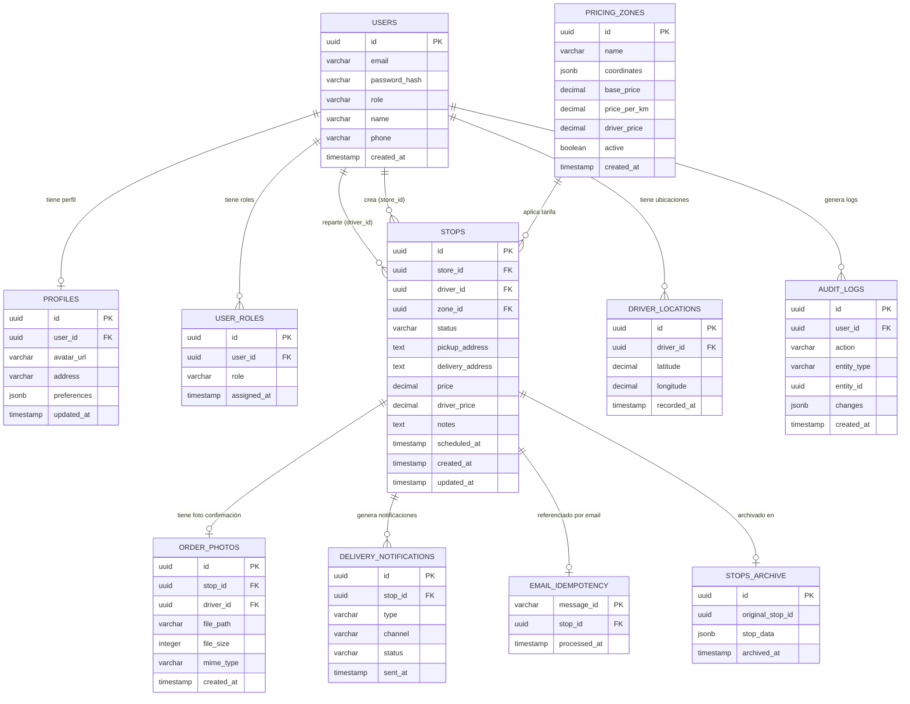
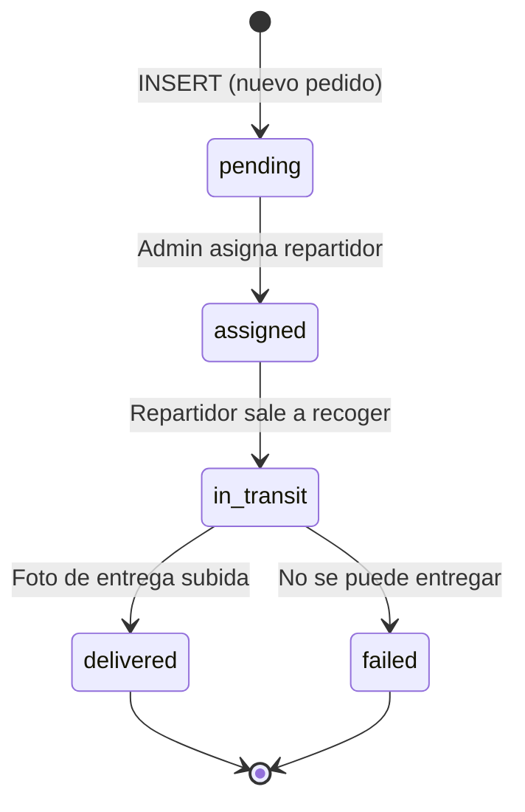

# Diagrama — Modelo de Base de Datos

## Entidad-Relación completo

## Descripción de tablas

| Tabla | Propósito | Filas estimadas |
|---|---|---|
| `users` | Usuarios del sistema (admin, tienda, repartidor) | Decenas |
| `profiles` | Datos extendidos de perfil | 1 por usuario |
| `user_roles` | Asignación de roles por usuario | 1-2 por usuario |
| `stops` | Pedidos activos y recientes | Cientos (rotación continua) |
| `stops_archive` | Histórico de pedidos completados | Creciente |
| `order_photos` | Referencias a fotos de entrega | ~600 máximo (limpieza 20 días) |
| `pricing_zones` | Zonas de reparto con tarifas | Decenas |
| `driver_locations` | Posición en tiempo real de repartidores | Alta rotación |
| `audit_logs` | Trazabilidad de acciones críticas | Creciente |
| `email_idempotency` | Control de emails procesados por n8n | Creciente (bajo volumen) |
| `delivery_notifications` | Registro de notificaciones enviadas | Creciente |

## Estados de un pedido (stops.status)

## Índices de rendimiento aplicados (migración 002)

| Índice | Tabla | Campo | Justificación |
|---|---|---|---|
| `idx_stops_store_id` | stops | store_id | Filtrado de pedidos por comercio |
| `idx_stops_driver_id` | stops | driver_id | Filtrado de pedidos por repartidor |
| `idx_stops_status` | stops | status | Filtrado por estado activo/completado |
| `idx_stops_created_at` | stops | created_at | Ordenación cronológica |
| `idx_stops_zone_id` | stops | zone_id | Agrupación por zona |
| `idx_order_photos_stop_id` | order_photos | stop_id | Acceso a foto por pedido |
| `idx_order_photos_created_at` | order_photos | created_at | Limpieza por antigüedad |
| `idx_driver_locations_driver` | driver_locations | driver_id | Localización por repartidor |

## Migraciones aplicadas

| Migración | Descripción |
|---|---|
| `001_schema_inicial.sql` | Tablas base: users, profiles, stops, pricing_zones |
| `002_performance_indexes.sql` | Índices de rendimiento para consultas frecuentes |
| `004_pricing_zone_driver_price.sql` | Campo driver_price en stops y pricing_zones |
| `007_delivery_notifications.sql` | Tabla delivery_notifications |
| `008_email_idempotency.sql` | Tabla email_idempotency para n8n |
